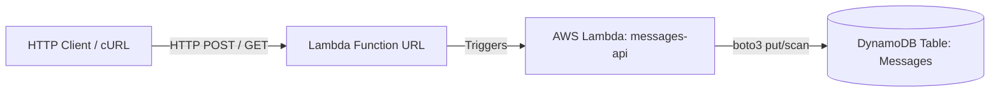

# LocalStack Serverless Messages API

A local development environment for an AWS serverless microservice using Docker and LocalStack. It provisions a Python AWS Lambda function behind a public Function URL and a DynamoDB table for storage.



## Project Structure
* `docker-compose.yml`: Defines the LocalStack container and mounts initialization scripts.
* `setup.sh`: Bootstraps the AWS infrastructure (DynamoDB, Lambda, Function URL) automatically on container startup.
* `src/handler.py`: The Python Lambda function containing the API logic.
* `curl-scripts.txt`: Example requests for testing the API.

## Prerequisites
* Docker and Docker Compose installed.

## Quick Start

1. **Start the environment:**
   ```bash
   docker compose up -d
   ```
On startup, LocalStack will execute setup.sh to provision the DynamoDB table and Lambda function.

2. **Retrieve the Lambda Function URL:**
Check the LocalStack container logs to find the generated endpoint:

```Bash
docker logs lstk-serverless | grep "http://.*lambda-url"
```

3. **Test the API:**
Use the URL retrieved from the previous step to create a message:

```Bash
curl -i -X POST "<LAMBDA_URL>" \
  -H "Content-Type: application/json" \
  -d '{"message": "Hello from LocalStack!"}'
```

Fetch all messages:

```Bash
curl -i -X GET "<LAMBDA_URL>"
```
